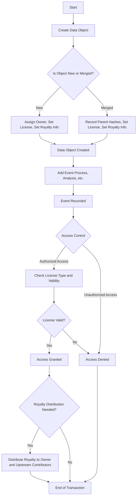
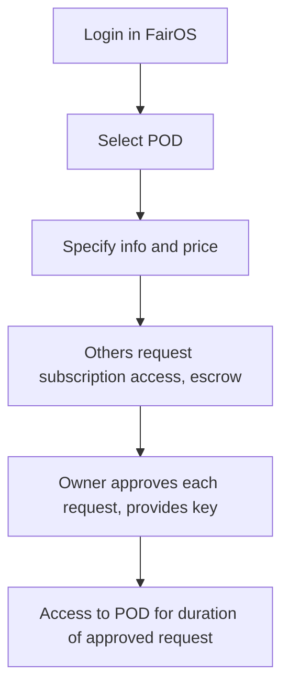
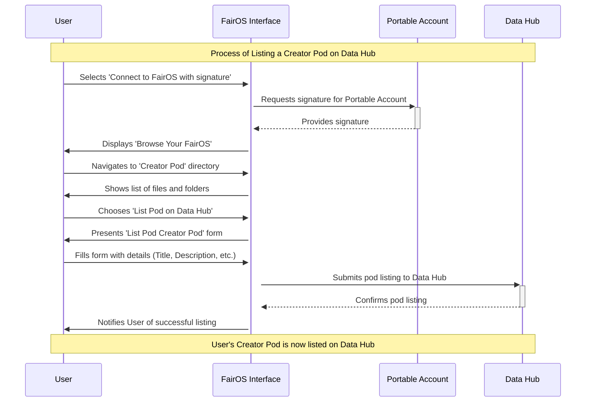

# Data supply chains 

## Steps and processes
- collection
- procesing 
- analysis
- distribution 
- access control

1. Datafund 
2. You can connect Fairdrive and create a new "Creator POD", creator pods can be monetized through, monetize your content. 
"enabling decentralized permisonless creator economy." 
"Transforming data into assets" 
"This is an announcement for what is comming next year",
"Position Datafund at the forefront of the Swarm ecosystem of enabling FairData economy"  
3. don't go technical; keep clear statement; 

So the idea is to have secure communication using blockchain and Swarm

- Create Creator Pod (input create pod)
- put 3 BZZ 
- Copy to Creator Pod 
- Shared link
- Pay for access

- Datafund
- Fairdrive (omogočimo uporabniku da si kupi svoj stamp - depth 24)
- Invites ne vemo ali so uporabljeni ali ne (balance)
- Explore (ukinemo kar ne dela, dodamo datafund) 
- After account migration is not the same account as metamask account 

Problems: 
- Define Front page 
- Invites: Are they working ? Fix UX, we need to see which invites were used and insure that they are working
- Link account povezat postage stamp (Da lahko uporabnik poveže stamp id s svojim accountom)
- Login check (Metamask and portable account) is not same account 
- Prepare documentation for FairDrive, how to store and how to read.  
- Fork Gnosis Safe DAO - terms, services, policy, Miha nas pelje through the value of shadows. 
- Leave only metamask (FDS account requires cash)

Plan:
 Main annoucement: Fairdrive DAO
      core: upload, download and other apps can load and save data to Fairdrive
            100.000 BZZ tokenov
 Datafund app interacting with FairOS 
 Prepare FairOS API to be S3 look-alike 
 Skrijemo FDP account, skrijemo migracijo, pripravimo plan
 fairdrive.io/upgrade-account (full settings to load in) cheat code 

Why notion: 
 Knowledge graph 
 Voting - Governance 
 Documentation
 Task management 
 Discussion 

Why not Roam:

Demo sepolia account: (do not use for your data (demo account only))
demotimex2 / passwordpassword
seminar
earn
cat
toss
verify
clean
list
birth
utility
frozen
glue
fish

address: 0x454013927dde97330E33602fb60331C13c2f0867

# Embracing Stoicism in the Digital Age: The Dawn of Creator PODs

I bring before you not just an innovation, but a philosophical shift in the digital realm – the advent of Creator PODs, a concept deeply intertwined with the principles of Fairdrive. This breakthrough is more than a technological stride; it's a reflection our modern digital world, marking Datafund's pioneering role in the Swarm ecosystem and championing the FairData economy.

At the heart of Creator PODs is a virtue – the empowerment of creators through self-control and autonomy over their digital creations. These PODs are unique digital sanctuaries where creators can store, manage, and monetize their content. In a world where external forces often dominate, these PODs stand as a testament to the belief in focusing on what we can control – our content and its value.

The transformation of data into assets within these PODs is akin to the practice of turning obstacles into opportunities. Creator PODs do not just store data; they transform it into something of value, a true asset in the digital age. This is a direct application of the principle of transforming challenges into triumphs.

Simplicity and accessibility are key features of these PODs, echoing the ideal of clear and uncluttered living. While they are underpinned by complex technologies like smart contracts and blockchain, these are mere details compared to their overarching philosophy: to return control to the individual creator, a notion deeply rooted in our thoughts.

As we stand on the cusp of what's to unfold next year, we're not just witnessing a technological revolution but a philosophical renaissance in the digital world. This shift is about embracing the ideals of autonomy, resilience, and transformation in the realm of digital creation and monetization.

In conclusion, Creator PODs symbolize more than a new tool or platform; they represent a journey towards a decentralized, self-governed creator economy. They empower creators to monetize their content directly, embodying the ethos of control over one's own destiny.

Hello everyone,

Today, I'm thrilled to talk about a digital game-changer – Creator PODs.
This isn't just tech evolution; it's a mindset revolution. Datafund is leading the charge in the Swarm ecosystem, empowering creators with control over their digital works like never before. 

These PODs are our digital ateliers. They're where creators don't just store content – they turn it into digital gold, striking the balance between simplicity and innovation. No need to sweat the blockchain and smart contract details – it's all about putting power back in the hands of creators, allowing them to transform data into assets. 

Picture this: a new era where every creator masters their digital destiny. That's what's unfolding next year. Creator PODs are more than a platform; they're a beacon of autonomy and creativity in the landscape of digital content.

As we gear up for this transformative leap, we're not just launching a product; we're championing a philosophy. A future where creators call the shots, set their prices, and connect directly with their audience. This shift is about embracing the ideals of autonomy, resilience, and transformation in the realm of digital creation and monetization. 
In conclusion, Creator PODs symbolize more than a new tool or platform; they represent a journey towards a decentralized, self-governed creator economy. They empower creators to monetize their content directly, embodying the ethos of control over one's own destiny.

Thanks for joining us on this journey. Here's to shaping our digital future with courage and vision!
Marry christmas to everyone. 

