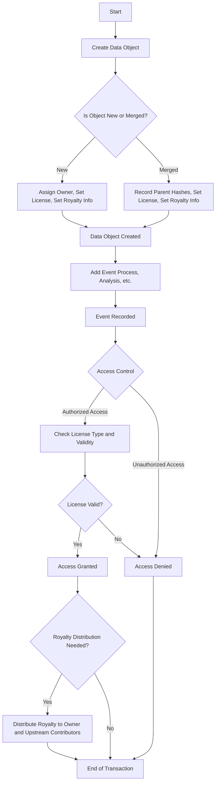

# Data supply chains 

## Steps and processes
- collection
- procesing 
- analysis
- distribution 
- access control

```mermaid
flowchart TD
    A[Start] --> B[Create Data Object]
    B --> C{Is Object New or Merged?}
    C -->|New| D[Assign Owner, Set License, Set Royalty Info]
    C -->|Merged| E[Record Parent Hashes, Set License, Set Royalty Info]
    D --> F[Data Object Created]
    E --> F
    F --> G[Add Event Process, Analysis, etc.]
    G --> H[Event Recorded]
    H --> I{Access Control}
    I -->|Authorized Access| J[Check License Type and Validity]
    I -->|Unauthorized Access| K[Access Denied]
    J --> L{License Valid?}
    L -->|Yes| M[Access Granted]
    L -->|No| K
    M --> N{Royalty Distribution Needed?}
    N -->|Yes| O[Distribute Royalty to Owner and Upstream Contributors]
    N -->|No| P[End of Transaction]
    O --> P
    K --> P
```

So the idea is to have secure communication using blockchain and Swarm