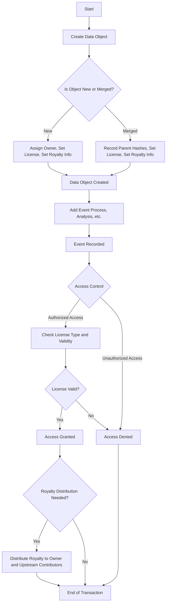

# Data supply chains 

## Steps and processes
- collection
- procesing 
- analysis
- distribution 
- access control

So the idea is to have secure communication using blockchain and Swarm

- Create Creator Pod (input create pod)
- put 3 BZZ 
- Copy to Creator Pod 
- Shared link
- Pay for access

- Datafund
- Fairdrive (omogočimo uporabniku da si kupi svoj stamp - depth 24)
- Invites ne vemo ali so uporabljeni ali ne (balance)
- Explore (ukinemo kar ne dela, dodamo datafund) 
- After account migration is not the same account as metamask account 

Problems: 
- Define Front page 
- Invites: Are they working ? Fix UX, we need to see which invites were used and insure that they are working
- Link account povezat postage stamp (Da lahko uporabnik poveže stamp id s svojim accountom)
- Login check (Metamask and portable account) is not same account 
- Prepare documentation for FairDrive, how to store and how to read.  
- Fork Gnosis Safe DAO - terms, services, policy, Miha nas pelje through the value of shadows. 
- Leave only metamask (FDS account requires cash)

Plan:
 Main annoucement: Fairdrive DAO
      core: upload, download and other apps can load and save data to Fairdrive
            100.000 BZZ tokenov
 Datafund app interacting with FairOS 
 Prepare FairOS API to be S3 look-alike 
 Skrijemo FDP account, skrijemo migracijo, pripravimo plan
 fairdrive.io/upgrade-account (full settings to load in) cheat code 

Why notion: 
 Knowledge graph 
 Voting - Governance 
 Documentation
 Task management 
 Discussion 

Why not Roam:

Demo sepolia account: (do not use for your data (demo account only))
demotimex2 / passwordpassword
seminar
earn
cat
toss
verify
clean
list
birth
utility
frozen
glue
fish

address: 0x454013927dde97330E33602fb60331C13c2f0867
